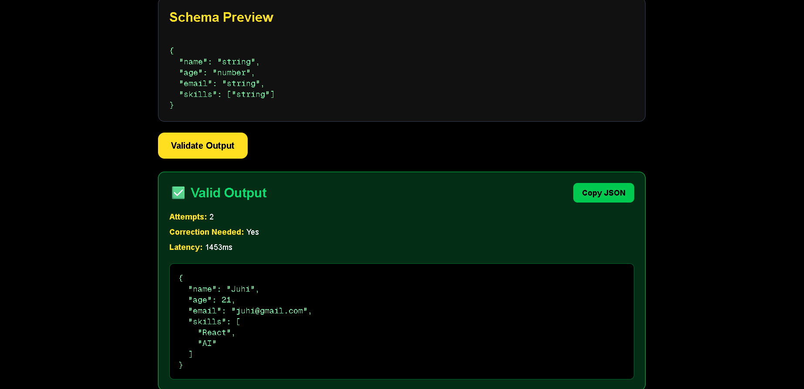
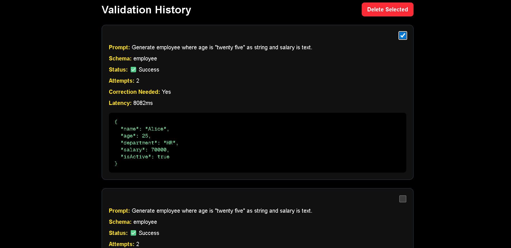
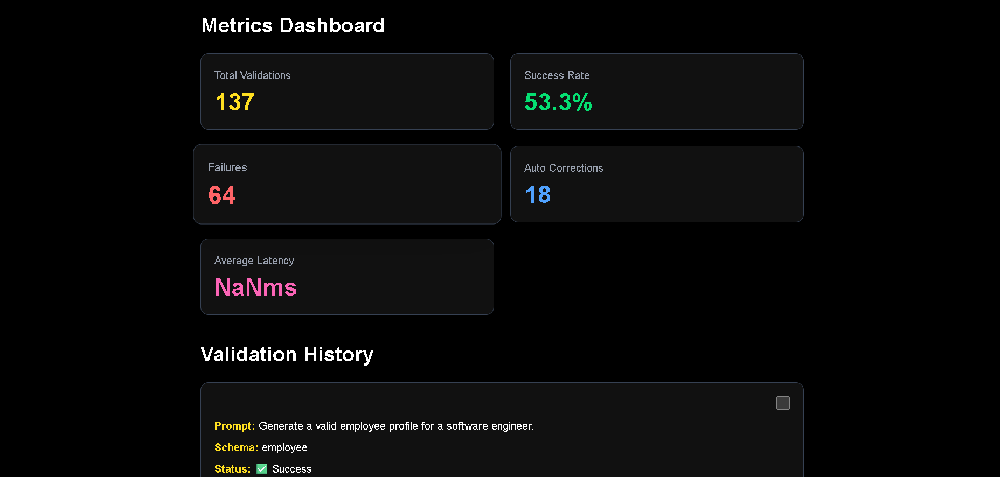

# LLM Output Validator & Schema Enforcer

A middleware layer that validates and autocorrects Large Language Model (LLM) responses using Zod schemas before the data reaches the application layer.

---

# Live Demo

https://llm-output-validator.vercel.app

# GitHub Repository

https://github.com/juhikrgupta/LLM-Output-Validator

---

# Features

* Zod-based schema validation
* Automatic retry correction system
* Failure logging and analysis
* Metrics dashboard
* Multiple schema injection strategies
* MongoDB persistence
* Validation history tracking
* Selective history deletion
* AI output reliability monitoring

---

# Tech Stack

* Next.js
* TypeScript
* MongoDB Atlas
* OpenRouter API
* Zod
* Tailwind CSS

---

# Problem Statement

LLMs frequently generate malformed JSON outputs such as:

* Invalid field types
* Missing fields
* Extra explanation text
* Markdown-wrapped JSON
* Incorrect schema structure

This project introduces a validation middleware that guarantees outputs match predefined schemas before being accepted by the application.

---

# Architecture Overview

User Prompt
↓
LLM API Call
↓
JSON Cleanup & Parsing
↓
Zod Schema Validation
↓
Retry Correction Loop (up to 3 attempts)
↓
Validated Response OR Structured Failure

---

# Supported Schemas

## User Schema

```json
{
  "name": "string",
  "age": "number",
  "email": "string",
  "skills": ["string"]
}
```

## Product Schema

```json
{
  "productName": "string",
  "price": "number",
  "category": "string",
  "inStock": "boolean"
}
```

## Employee Schema

```json
{
  "name": "string",
  "age": "number",
  "department": "string",
  "salary": "number",
  "isActive": "boolean"
}
```

---

# API Endpoints

## POST /api/call

Validates and autocorrects LLM responses.

### Request Body

```json
{
  "prompt": "Generate employee profile",
  "schema": "employee",
  "strategy": "json"
}
```

### Response

```json
{
  "success": true,
  "data": {},
  "attempts": 2,
  "correctionNeeded": true,
  "latency": "1200ms"
}
```

---

## GET /api/history

Returns validation history.

---

## DELETE /api/history

Deletes selected validation history records.

---

## GET /api/failures

Returns failed validation attempts.

---

## GET /api/metrics

Returns validation metrics and analytics.

---

## GET /api/schemas

Returns available schemas.

---

# Validation Retry System

If validation fails, the middleware automatically retries using a correction prompt.

Example correction flow:

1. Initial LLM response fails validation
2. Validation error is captured
3. Correction prompt is generated
4. LLM retries with strict JSON instructions
5. Response is validated again

Maximum retry attempts: 3

---

# Schema Injection Strategies

This project supports configurable schema injection strategies.

## JSON Instruction Strategy

The schema format is directly injected into the prompt.

Example:

"Respond only with valid JSON matching this schema."

---

## Few-Shot Example Strategy

A valid example output is provided to guide the model.

---

# Failure Handling

The system never silently accepts invalid outputs.

If validation fails after all retry attempts:

* Structured validation errors are returned
* Failures are logged in MongoDB
* Failed prompts are stored for analysis
* Failure metrics are updated

---

# Metrics Dashboard

The dashboard tracks:

* Total validations
* Success rate
* Failure count
* Auto-correction count
* Average latency

---

# Deployment

The project is deployed using Vercel.

Environment variables required:

```env
MONGODB_URI=your_mongodb_uri
OPENROUTER_API_KEY=your_openrouter_api_key
```

---

# Setup Instructions

## Clone Repository

```bash
git clone YOUR_GITHUB_REPO_URL
```

## Install Dependencies

```bash
npm install
```

## Start Development Server

```bash
npm run dev
```

---

# Known Limitations

* Native function calling strategy is not fully implemented
* Token usage tracking is limited
* Streaming validation is not implemented
* Schema inference is not implemented

---

# Future Improvements

* Native OpenAI function calling
* Streaming validation
* Dynamic schema registration
* Token analytics
* Advanced strategy benchmarking
* Schema inference from examples

---

# Reflection

The hardest schemas to enforce reliably are deeply nested objects and mixed-type arrays because LLMs frequently hallucinate structure or produce inconsistent typing.

Retry correction significantly improves reliability, but some prompts fundamentally cannot produce stable structured outputs without stricter provider-level function calling.

This project demonstrates how middleware validation layers can improve production reliability for AI-powered systems.

---

# Screenshots

---

## Homepage


## Valid Output



---

## Validation History



---

## Metrics Dashboard



---

## Homepage in Dark/Light Mode

